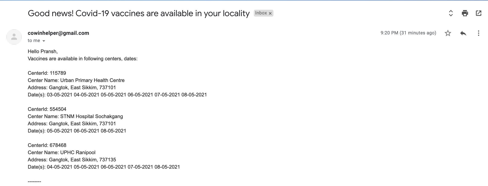

# cowin_helper
Sends email alerts when covid vaccines become available.

As of 1st May, all adults are eligible for vaccination against Covid-19. But due to huge demand, only some centers have the vaccine stocks available. 

Based on the public data from https://www.cowin.gov.in, this is an open-source vaccine tracker that will monitor the vaccine availability near you and will send email alerts as stocks become available.

You just need to fill out this google form: https://forms.gle/NHEmAxLzvkX9Cn35A and the script will run every hour and send out email alerts to you, if the vaccines are available in the pincodes which you have provided.

* You can unsubscribe at any point you want, by just replying on the email.

* You will be emailed only when the vaccines are available (No Spams). 

* You can enter multiple pincodes, and edit the form any point you want, adding or removing pincodes etc.

### Screenshots
|  |  |
| --- | --- |
| | |
